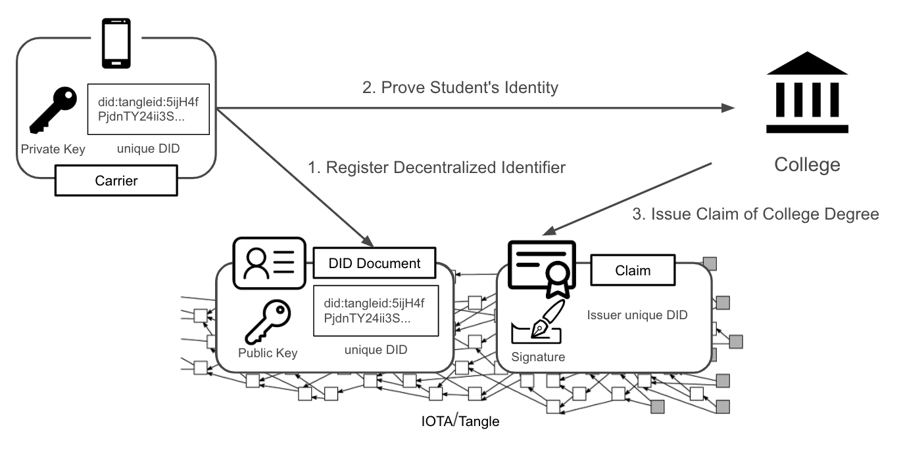
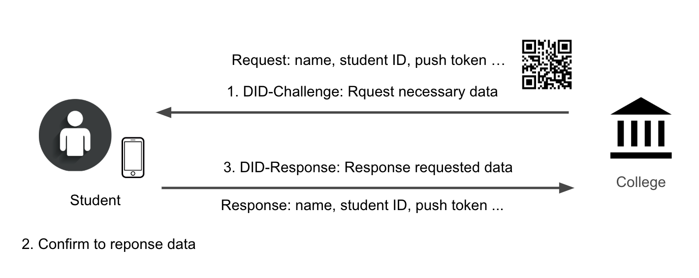
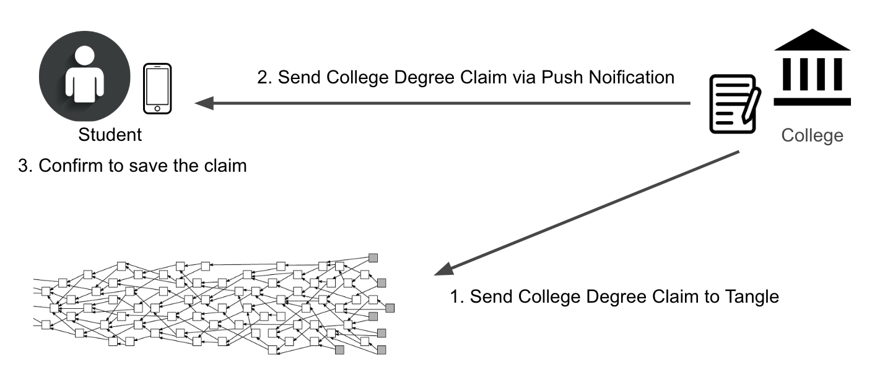

# TangleID Demo Site

This sample web service is designed to illustrate how a certification website issues an claim to the identity holders with [TangleID](https://github.com/TangleID).



The scenario we choose is the certification process and the roles contain:
 - Student: As a holder, a student is able to arrange his or her personal data and claims with verified carriers.
 - College: As an issuer, a college can issue verifiable claims to the holders after verifying students' identity.

## Flow

### Step1: Register the Decentralized Identifier

At first, students (holders) have to create new digital identities on Tangle and the registration includes 2 steps:
1. Download the application (APP) on devices, such as mobile or tablets
2. Create a new account and sign in

### Step2: Sign in by Verifying the Digital Identity



After the accounts created, the next step is Sign in. Students (Holders) are required to scan the QR Codes provided by the [website](http://demokits.biilabs.io:4500/) in order to decide what data will be revealed.

### Step 3: Self-sovereign Identity Interaction



With all preceding procedures done, students' digital identities can finally make their own footprints. For example, students can directly send requests to their college to get their certificates of degree with TangleID. In other words, the issue of diploma can be digitalized to save time and money.

## Building from Source

Clone the repository.

```shell
$ git clone https://github.com/TangleID/demo-site.git
```

Install the package dependencies.

```shell
$ cd demo-site
$ yarn
```

Launch the application.

```shell
$ yarn start
```

## Licensing

This website is freely redistributable under the MIT License. Use of this source
code is governed by a MIT-style license that can be found in the `LICENSE` file.
